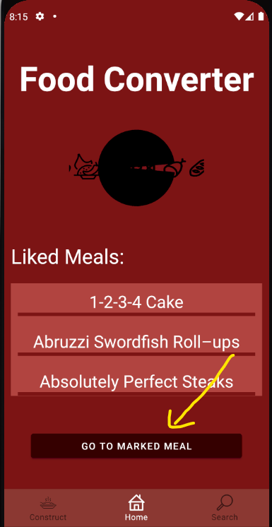

# Foodconverter

_Die App bietet zum einen die Möglichkeit neue Gerichte zu entdecken, um so den Gerichtshorizont der Nutzer zu erweitern. Außerdem dient sie auch als Rezeptdatenbank, wodurch Nutzer die Möglichkeit eigene Rezepte langfristig zu speichern und durch die Suchfunktion auch immer wieder an deren Existenz erinnert zu werden. Zuletzt bietet die App durch die Suchfunktion und das marken des Gerichts auch eine mobile Einkaushilfe und durch das liken eine Sammelmöglichkeit favorisierter Gerichte._

## Zielgruppe und Problemstellung

_Als erste Zielgruppe kommen natürlich zunächst Studenten in Frage, frisch aus dem Elternhaus wissen viele nicht wirklich wie viele Gerichtvarianten es gibt und auch der Geldbörse kommt eine Verwertung von Resten auf jeden Fall zu gute. Auch Menschen die gerne und viel kochen, wodurch natürlich auch viel Essen gekauft wird, kann der Foodconverter eine Hilfe sein. Man kocht so viel und das speichern von Gerichten die einem gefallen haben, verbunden mit dem erinnert werden ohne wahllos in einem Kochbuch rumzublättern, hilft bestimmt auch dem ein oder anderen Hobbykoch bei der Gerichtsfindung._

## Features und Szenarien

### Funktionen

Die erste Funktion ist natürlich zum einen die Suche von Gerichten anhand von Zutaten. Hiermit kann der Nutzer anhand von vorgegebenen Zutaten Gerichte finden und mit den Kennzahlen vergleichen, welche Gerichte für seine Zutatenauswahl am besten passen. 

Die zweite wichtige Funktion ist das bookmarken eines Gerichts BILD2, mit dieser Funktion kann der Nutzer das Gericht für welches er sich entschieden hat speichern und hat auf dieses einen schnellen Zugriff von der Startseite aus (auch wenn die App geschlossen wurde). 

Die nächste wichtige Funktion ist das liken von Gerichten BILD3. Hiermit kann der Nutzer während der Nutzung der App Gerichte vermerken die ihm besonders gefallen und diese gesondert in einer Liste speichern, auf welche schnell über den Startscreen zugegriffen werden kann. 

Als weitere Funktion muss natürlich das Gericht erstellen genannt werden. Der Nutzer kann dadurch eigene Gerichte speichern BILD4, um diese dann später auch wieder durch die Suchfunktion zu finden und sie somit nicht zu vergessen.

### Walktrough

*1.Szenario*

_Der Nutzer merkt das er Lebensmittel viele Lebensmittel übrig hat und kann sich kein Gericht damit vorstellen auf das er Lust hat. Er öffnet die App gibt die Lebensmittel mit der **Search-Funktion** ein. Die App schlägt ihm Gerichte bezüglich der Zutaten vor und der Nutzer sucht sich eins aus. Falls es ein **Any** Gericht ist speichert er es mit der **mark** Funktion und kann beim einkaufen der noch benötigten Lebensmittel wieder einfach auf das Gericht zugreifen. Falls es ein **All** Gericht ist kann der Nutzer sofort mit dem kochen beginnen._

*2.Szenario*

_Der Nutzer entdeckt auf anderen Wegen ein Gericht was ihm gefällt, er öffnet die App und erstellt das Gericht über die **Construct-Funktion**. Er legt noch benötigte Zutaten an und designt die Zubereitung wie sie ihm entspricht. Durch das automatische Laden der Zutaten in die **Search-Funktion** kann er es immer wieder finden wenn er die Zutaten dafür hat und wenn er es liked ist es nochmals extra vorgemerkt._

## Erreichter Stand

_Der Stand den ich mit der App erreicht habe war im großen und ganzen im vorhinein auch so geplant. Einzig die Rezept-Datenbank, welche ich durch ein JSON-File gelöst habe hätte ich gerne ausführlicher gestaltet, mit viel mehr Rezepten und vielleicht per Dataprovider aus dem Netz generiert. Auch das geplante Threading der Datenbankzugriffe habe ich nicht mehr geschafft. Der Grund ist vor allem, dass ich versucht habe alles zu schaffen trotz dem abspringen meiner Projektpartnerin (an der Stelle sei auch gesagt, dass hier absolut kein böses Blut herrscht. Es hat sich nach den ersten großen implementation Schritten gezeigt, dass diese Art der Programmierung noch zu schwer für sie war, wofür ich auch Verständnis habe)._

## Weitere Hinweise

_Wenn ich die App neu herunterlade kriege ich einen Missing SDK Fehler. Nach dem Neustart von AndroidStudio funktioniert es meistens. Im schlimmsten Fall muss das local.properties File manuell ergänzt werden. Außerdem hatte ich Probleme beim Mergen meiner zwei Branches, deswegen habe ich den dev-Branch zum master-Branch umbenannt und ihn zum default-Branch gemacht, weil auf diesem alles immer einwandfrei funktioniert hat. Außerdem habe ich die DeleteAll Funktion der DB drinnen gelassen(mit Button auf ConstructFragment), weil sich damit gut Funktionen testen lassen. Viel Spaß beim testen des Foodconverters!_
