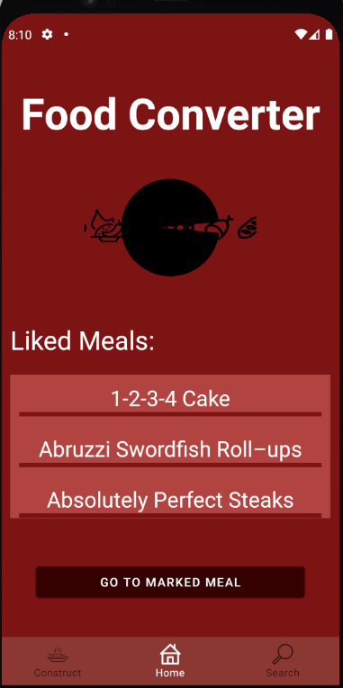

# Foodconverter

_Die Foodconverter App dient dem Verwerten übrig gebliebener Lebensmittel und dem entdecken, sowie merken von Gerichten._
### Ziele:
* aufbrauchen von Lebensmitteln durch Rezepte, welche diese genau beinthalten
* anreize für neue Rezeptideen schaffen auf Grundlage der eingegebenen Zutaten
* eigenes Erstellen von Rezepten, um diese im Kopf zu behalten
* gesunde Rezeptalternativen anbieten, durch vegan/vegetarisch Filter

### Funktionen:
* **Suchen** und **Auswählen** von Lebensmitteln aus einer vorgefertigten Liste
* **Anzeigen** der Suchergebnisse, auf Grundlage von den ausgewählten Lebensmitteln
* **Filtern** der Suchergebnisse nach eigenen Kriterien
* **Browsen** durch Rezeptdatenbank
* **Erstellen** eigener Rezepte und Lebensmitteln
* **Löschen** unerwünschter Rezepte
* **Speicheren** von Rezeptfavoriten in eigener Liste
* Hervorgehobenes **Anzeigen** des ausgewählten *zu kochenden* Rezepts

### Trailer-Preview

### Screen

## Übersicht über weitere Dokumente

- [_User Guide_ zur App](App.md)
- [Das Team](Team.md)
- [Link zum Trailer](./docs/FoodConverterTrailer.mp4)
- [APK-Datei der fertigen Version](./docs/app-release.apk)
