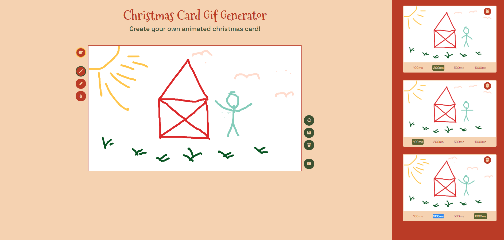

# Maximilian-Schmerle-Portfolio

## JavaAndroidApp *Food Converter*
* Trailer und BeispielGifs befinden sich im jeweiligen Ordner

## PythonDrawingApp
* Programm wird über Terminal gestartet *Python3 vektor.py*
* Es können quadratische Bezierkurven, Polygone, Rechtecke und Kreise erstellt werden
* Das komplette Canvas kann verschoben werden und die Kontrollpunkte ausgeblendet werden
* Eine Farbauswahl und die Veränderung der Kontrollpunkte ist auch möglich
* Ein Trailer liegt mit im Ordner vor

## WebApp *ChristmasCardMaker*
* Mit dieser BrowserAnwendung werden Bilder gezeichnet
* Diese können als Frames gespeichert werden und eine Laufzeit angegeben werden
* Im letzten Schritt können die Bilder dann zu einer Animation verknüpft werden
* Funktionen wie das Löschen des komplettem Canvas, sowie Undo der letzten Zeichenaktion und verschiedene Stiftdicken sind auch vorhanden
* Außerdem gibt es eine Farbauswahl und einen Radierer

