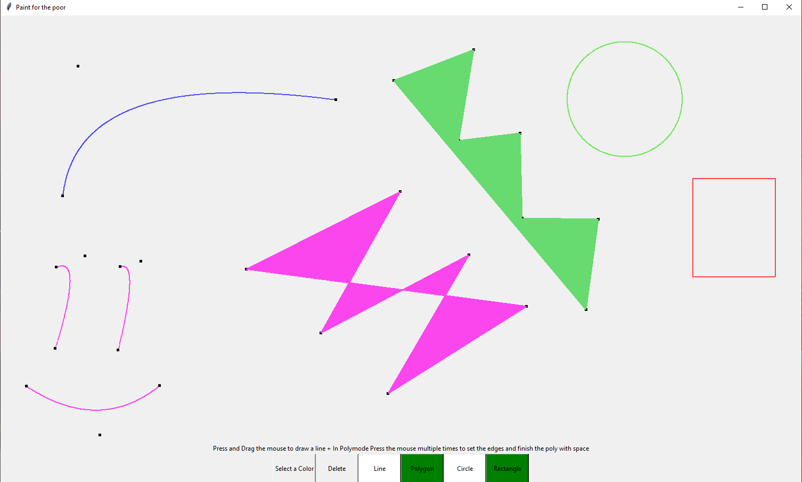

# Maximilian-Schmerle-Portfolio

## JavaAndroidApp (Food Converter)
Trailer und BeispielGifs befinden sich im jeweiligen Ordner

## PythonDrawingApp
* Programm wird über Terminal gestartet *Python3 vektor.py*
* Es können quadratische Bezierkurven, Polygone, Rechtecke und Kreise erstellt werden
* Das komplette Canvas kann verschoben werden und die Kontrollpunkte ausgeblendet werden
* Eine Farbauswahl und die Veränderung der Kontrollpunkte ist auch möglich
* Ein Trailer liegt mit im Ordner vor

